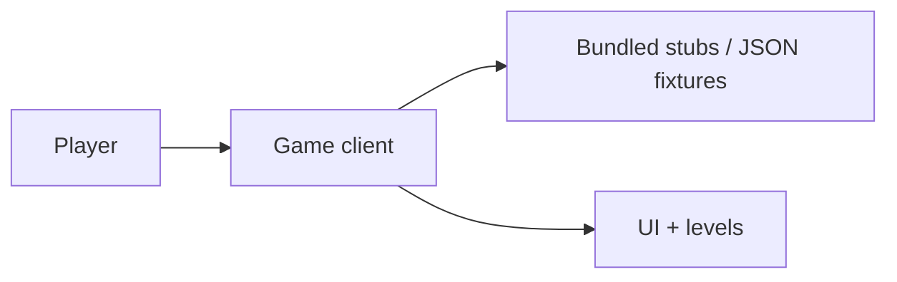

# Product Requirements Document

**Source (Notion):** [PRD — Germain’s App (Cursor Learning Game)](https://www.notion.so/35dda74ef0458082b4b0e57e46313c1e)

| Field | Value |
| --- | --- |
| **Document** | PRD — Germain’s App (Cursor Learning Game) |
| **Version** | 1.0 |
| **Last updated** | 2026-05-11 |
| **Status** | Draft — ready for review |
| **Classification** | Public (shareable; intended open/public distribution) |

## 1. Executive summary

Germain’s App is a **simple, browser-based mini-game** styled after classic side‑scrolling platformers (Mario‑style mechanics and presentation principles). Through short levels and lightweight narrative beats, players learn about **Cursor’s customers**, **value delivered**, **Cursor products**, **recent releases**, and the **software development lifecycle (SDLC)**.

The product targets **low complexity**, **no reliance on external APIs**, **stubbed or local-only data** wherever live integrations would otherwise be required, and a **public** project posture (code and artifacts suitable for public repos or sites).

---

## 2. Problem statement

Cursor users and stakeholders benefit from **accessible, memorable onboarding** to Cursor’s ecosystem—who benefits from the product, what outcomes matter, how the product fits together, what shipped recently, and how software is built end‑to‑end. Dense documentation alone does not suit everyone; a **short, playful experience** can reinforce retention and curiosity.

---

## 3. Goals and non-goals

### 3.1 Goals

1. Deliver a **playable prototype** that teaches the themes above in **under ~15 minutes** of casual play.
2. Use **Mario‑inspired** level structure (run/jump, obstacles, goals, optional collectibles) without copying proprietary assets or trademarks.
3. Keep implementation **simple**: single codebase, minimal dependencies, runs locally or on static hosting.
4. **No external API calls** at runtime; use **stubs**, fixtures, or bundled JSON for “live” content.
5. Treat the effort as **public-by-default** (license, repo visibility, deployable static output).

### 3.2 Non-goals

- Full multiplayer, accounts, or cloud saves.
- Real-time customer analytics, billing, or CRM integrations.
- Pixel-perfect recreation of any commercial game; **homage only**.
- Certification-grade SDLC training (keep explanations **high level** and accurate).

---

## 4. Target audience

| Segment | Needs | Success looks like |
| --- | --- | --- |
| New Cursor users | Orientation to product value and vocabulary | They finish a level and recall 2–3 concrete takeaways |
| Developers evaluating Cursor | Quick sense of workflow + release cadence | They understand where Cursor fits in SDLC at a glance |
| Internal champions / educators | Shareable demo link or repo | They can walk someone through in one sitting |

---

## 5. Product overview

### 5.1 Core concept

- **Genre**: 2D side‑scroller / platformer (Mario‑style **feel**: momentum, jumping, hazards, flagpole-style goal).
- **Pedagogy**: Each **world** or **zone** maps to a theme: customers & value, product surface area, releases, SDLC.
- **Content**: Copy is **short** (tooltips, NPC-style blurbs, level titles). No wall of text mid-jump.

### 5.2 “Public + simple + no APIs” architecture (conceptual)

- **External APIs**: **Not used**. Any feature that would normally call an API (e.g. “latest release”) reads from **`releases.stub.json`** or similar, committed to the repo.
- **Updates**: Refreshing marketing facts is a **content edit + redeploy**, not a live fetch.

---

## 6. Functional requirements

| ID | Requirement | Priority |
| --- | --- | --- |
| FR-01 | Player can move, jump, and complete at least **one full level** with a clear win state. | P0 |
| FR-02 | Game surfaces **educational snippets** tied to progression (e.g. signs, modal cards after checkpoints). | P0 |
| FR-03 | Content covers four strands: **customers & value**, **Cursor products**, **recent releases** (stubbed list), **SDLC overview**. | P0 |
| FR-04 | **Restart / retry** from death or fall; **pause** optional but recommended. | P1 |
| FR-05 | Win screen summarizes what the player learned (3 bullets max). | P1 |
| FR-06 | All dynamic text loads from **local stub files** or in-repo constants (no network for CMS/API). | P0 |

---

## 7. Non-functional requirements

| ID | Requirement | Target |
| --- | --- | --- |
| NFR-01 | **Simplicity**: Small dependency footprint; one primary runtime (e.g. web canvas or lightweight engine). | Auditable `package.json` / minimal stack |
| NFR-02 | **Privacy / network**: No third-party telemetry required; **no outbound API calls** for core flows. | Offline-capable build optional stretch |
| NFR-03 | **Public project**: License file, README with run instructions, suitable for public Git hosting. | Explicit OSS-friendly license |
| NFR-04 | **Accessibility (baseline)**: Readable text contrast; keyboard controls where feasible. | WCAG not fully scoped—document known gaps |

---

## 8. Content model (stubbed data)

Replace live feeds with versioned fixtures, for example:

- **`content/customers.json`** — anonymized or illustrative customer archetypes and value statements.
- **`content/products.json`** — names and one-line descriptions of Cursor surfaces (Agent, CLI, etc.) — **fact-checked manually** when edited.
- **`content/releases.stub.json`** — version labels and dates as **static copies**, not fetched from GitHub or Cursor APIs.
- **`content/sdlc.json`** — short ordered stages (plan → build → test → ship → observe) with one tooltip each.

> **Rule**: If a stakeholder asks for “always up to date” releases, the answer in-scope is **manual stub refresh**, not API polling.

---

## 9. Success metrics

| Metric | Definition | Initial target |
| --- | --- | --- |
| Completion rate | % sessions reaching win screen | ≥ 60% in informal testing |
| Time to complete | Median session length | 5–15 minutes |
| Learning recall | 3-question optional quiz after win (stubbed scoring) | ≥ 2/3 correct in pilot |

*(Instrumentation may be **local-only** or omitted for v1 to honor “no external APIs.”)*

---

## 10. Constraints and assumptions

- **Constraint**: **Zero runtime dependency** on external HTTP APIs for gameplay and educational content.
- **Constraint**: Art and audio must be **original, licensed, or clearly permitted** for a public repo.
- **Assumption**: Educational copy will be **reviewed** by someone familiar with Cursor messaging before wide distribution.
- **Assumption**: “Mario bros theme and principles” means **gameplay tropes** (platforming, worlds, progression), not franchise assets.

---

## 11. Milestones

1. **M1 — Vertical slice**: One level, stub content files, win/lose states.
2. **M2 — Full teach loop**: Four themed zones or equivalent structure; polish copy.
3. **M3 — Public release**: README, license, static deploy, smoke tests on target browsers.

---

## 12. Risks and mitigations

| Risk | Mitigation |
| --- | --- |
| Stale release stubs mislead users | Date the fixture file; link to official changelog in README only |
| Scope creep into “real” integrations | Gate features against PRD §5.2 and §8 |
| IP/trademark concerns | Original sprites/music; avoid Nintendo marks and characters |

---

## 13. Open questions

- [ ] Final tech stack (plain Canvas vs. Phaser vs. Godot web export)?
- [ ] Exact tone for Cursor-specific copy (formal vs. playful)?
- [ ] Minimum browsers and devices for v1?
- [ ] Optional post-game "learn more" links (still **no** auto-fetch; links only)?

---

## 14. Approval

| Role | Name | Date |
| --- | --- | --- |
| Product owner | | |
| Engineering lead | | |
| Content reviewer | | |
